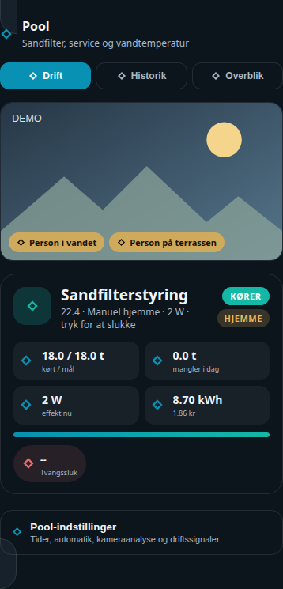

# HA Pool Card

## Neutral mobile preview



> Rendered at 390 px mobile width with fictional Home Assistant entities and values. No private dashboard, person, address, camera, or sensor data is included.


A single Home Assistant Lovelace card that consolidates a full pool-management
page into one component:

- **Pump control** — live status (running / commanded / stopped), daily
  runtime vs. goal with a progress bar, power/energy/cost stats, and a mode
  timer that explains exactly what the automation is doing right now
  (auto-running, auto-paused, manual override, forced pause, after-swim
  extension)
- **Guided backwash / rinse wizard** — a 6-step state machine that walks
  through preparing, starting, running and finishing a sand-filter backwash
  or rinse cycle, with the right confirmation prompts at each step
- **Camera** — Home Assistant live stream from the configurable camera entity,
  with a snapshot placeholder during startup and occupancy badges (person in
  the water / person on the terrace). The default is the UniFi Protect medium
  resolution channel.
- **Status grid** — water temperature, pump state, temperature rise today,
  running cost today, filter progress, operating status
- **Status warning banner** — only shown when something needs attention
- **Assistant summary** — next automation action, best swim time today,
  today's low/high, pool cover status, forecast accuracy, maintenance status
- **7-day history chart** — daily high/low water temperature band plus
  sand-filter runtime bars, fetched live from Home Assistant's history API
- **Weather-based forecast chart** — expected temperature over the coming
  days with a widening uncertainty band and the "swim-ready" threshold line

## Configuration

All ~30 entity ids are configurable (see `getStubConfig()` in the source for
the full list and sensible defaults) — the required shape is just:

```yaml
type: custom:ha-pool-card
title: Pool
subtitle: Sandfilter, service og vandtemperatur
pump_switch_entity: switch.pool_pump_control
pump_running_entity: binary_sensor.pool_pump_running
# ...see getStubConfig() for every entity key
scripts:
  pause_1h: script.pool_pump_pause_1h
  backwash_start: script.pool_backwash_start
  # ...
settings_path: /your-dashboard/pool-settings
```

The camera is rendered through Home Assistant's native live camera card with
`camera_view: live`. Sensor and timer updates patch the existing card DOM, so
they do not recreate or restart an active stream. A full content rebuild only
happens when the user changes tab or the card configuration changes.

The card expects a Danish-language `input_select.backwash_status` with the
options `Inaktiv`, `Klar til BACKWASH`, `BACKWASH kører`, `Klar til RINSE`,
`RINSE kører`, `Sæt på FILTER` to drive the guided wizard, and a forecast
sensor exposing a `forecast_points` attribute (`[{datetime, temp}, ...]`).
